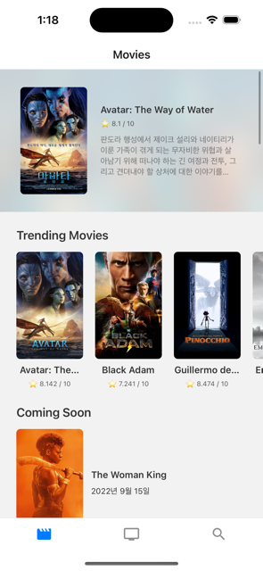
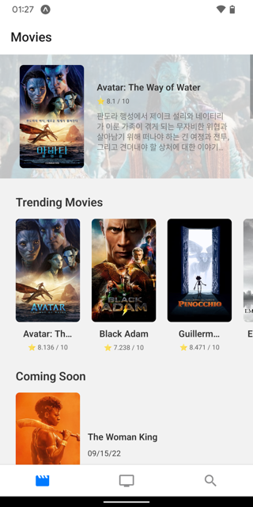

  

<h1 align="center">
  영화와 TV 프로그램 검색 앱
</h1>

## 👻 소개

IMDB에서 제공하는 API를 바탕으로 영화 및 TV 프로그램에 대한 정보를 검색하는 어플리케이션입니다.

## 🔧 사용한 npm 라이브러리들

- react-navigation
- react-query
- react-native-swiper
- styled-components
- expo-status-bar
- expo-splash-screen
- expo-blur

## 🚀 배포

- expo로 배포 예정
